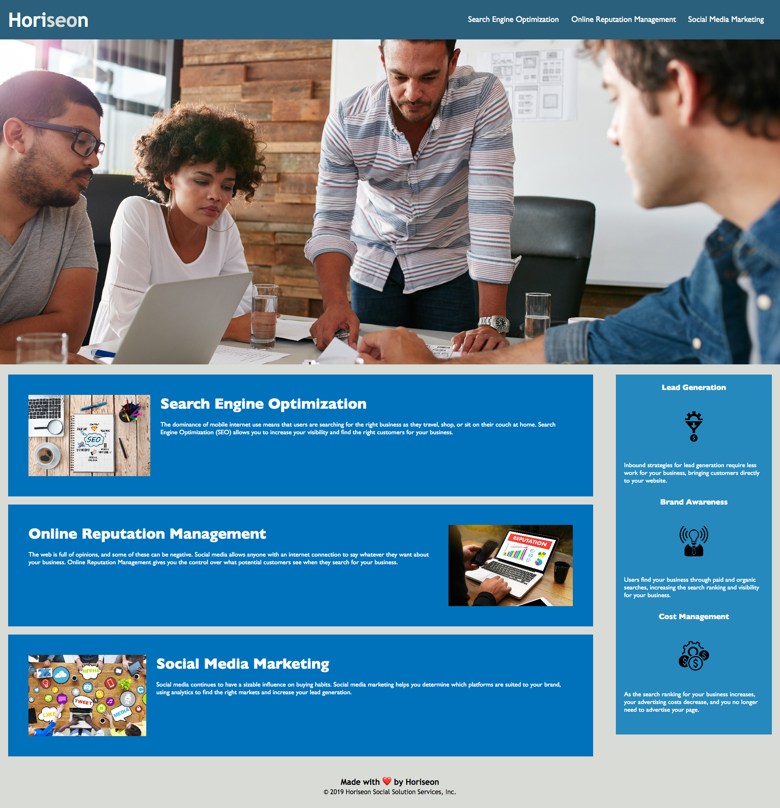
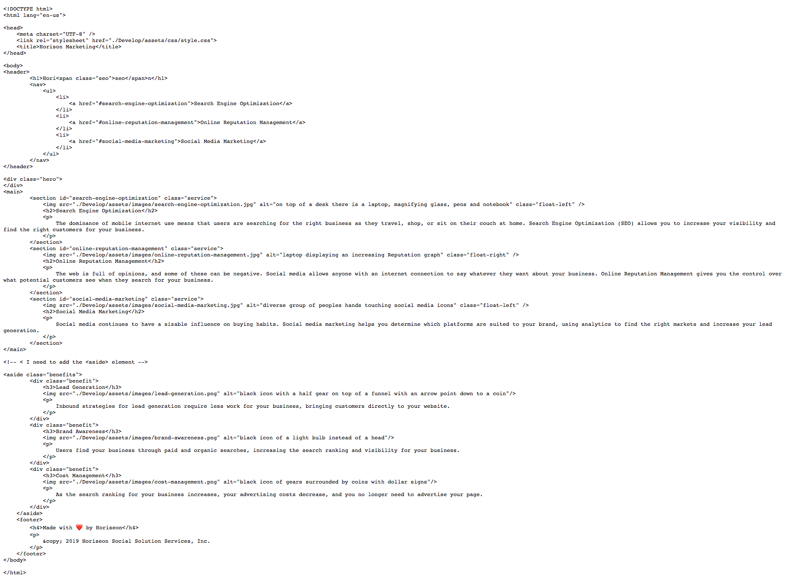

# Week 01 Homework: HTML CSS Git: Code Refactor
I refactor the client's website with the goal of increasing the website accesability.

## User Story

```
AS A marketing agency
I WANT a codebase that follows accessibility standards
SO THAT our own site is optimized for search engines
```

## Description
 In order to accomplish this goal I added the semantic elements header, nav, section, aside and footer. I consided the classes to 4. I added the alt attribute to images, changed the title for the website tab, and reorder the heading attributes to be in sequential order. Lastly I added comments to the CSS style sheet following a logical structure. 

 
## Screen shot

The following image shows the web application's appearance:
  

The follow image shows the html code: 
 


## Links 
Website's live link from GitHub (https://ndorado3.github.io/01-Code-Refactor/)

